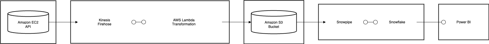

# Simulated Real-Time Market Automated Data Pipeline

## Project Overview
This project implements a real-time data pipeline to analyze global food market data across 36 countries and 2,200 markets. The pipeline streams data through AWS Kinesis, transforms it using Lambda functions, and loads it into Snowflake for analysis. The processed data is then visualized using Power BI for strategic insights into market trends and food prices.

## Architecture


The pipeline consists of the following components:
- AWS App Runner: Hosts the FastAPI application serving market data
- AWS Kinesis Data Streams: Collects real-time data from APIs
- AWS Kinesis Firehose: Processes and transforms data streams
- AWS Lambda: Converts JSON logs to CSV format
- AWS S3: Stores raw and transformed data
- Snowflake: Data warehouse for analytics
- Snowpipe: Automated data ingestion from S3
- Power BI: Data visualization and reporting

## Dataset
- Scope: 36 countries, 2,200 markets
- Data Points: Food items with price metrics (open, high, low, close)
- Additional Metrics: Inflation rates, trust indicators

## Prerequisites
- AWS Account with appropriate permissions
- Python 3.x
- Required Python packages:
  - boto3
  - requests
  - pandas
  - json
- Snowflake account
- Power BI Desktop

## Installation & Setup

1. Clone the repository
```bash
git clone [repository-url]
cd [project-directory]
```

2. Install required Python packages
```bash
pip install -r requirements.txt
```

3. Configure AWS credentials
```python
# Configure in your environment or AWS credentials file
AWS_ACCESS_KEY_ID = 'your-access-key'
AWS_SECRET_ACCESS_KEY = 'your-secret-key'
AWS_REGION = 'your-region'
```


## API Endpoints
- Base URL: https://vf23h36ius.us-east-2.awsapprunner.com
- Endpoint: /fetch_data
- Parameters:
  - year (string): Year for data retrieval
  - Example: /fetch_data?year=2007

## Automated Data Pipeline Flow

The entire pipeline is automated, where each step triggers the next automatically:

1. **Data Source & API (AWS App Runner)**
   - Dataset is exposed via FastAPI endpoint
   - API deployed on AWS App Runner
   - Endpoint: `/fetch_data` accepts year, country, market parameters
   - Returns filtered data in JSON format

2. **Automatic Data Transformation (Lambda)**
   - When API is called, Lambda function is triggered
   - Lambda automatically:
     - Receives JSON data
     - Converts it to CSV format
     - Handles any necessary data cleaning
     - No manual intervention needed

3. **Automated Storage (S3)**
   - Lambda automatically saves CSV to designated S3 bucket
   - Files are organized in predefined structure
   - No manual file management required

4. **Automatic Data Loading (Snowpipe)**
   - Snowpipe continuously monitors S3 bucket
   - When new files appear, automatically:
     - Detects new data
     - Loads it into Snowflake raw tables
     - Maintains data freshness

5. **Automated Data Transformation (Snowflake)**
   - Scheduled tasks in Snowflake automatically:
     - Process new data
     - Apply transformations
     - Update analytics tables
     - Track record counts and changes

6. **Real-time Analytics**
   - Transformed data immediately available for:
     - Analytics queries
     - Dashboards
     - Reports
     - Business insights

The beauty of this pipeline is that after initial setup, everything runs automatically:
- One API call triggers the entire flow
- No manual intervention needed
- Real-time data processing
- Automatic error handling and logging
- Continuous data refresh

## Snowflake Setup
1. Create database and tables
2. Configure external stage
3. Set up Snowpipe
4. Create transformation procedures
5. Schedule tasks for regular processing

## Monitoring & Maintenance
- Monitor Kinesis streams in AWS Console
- Check Snowpipe ingestion status
- Review Lambda function logs
- Schedule regular data transformations

## AWS App Runner Setup

### Prerequisites
1. AWS Account with appropriate permissions
2. GitHub repository with your FastAPI application
3. Two required files in your repository:
   - `requirements.txt` - Lists Python dependencies
   - `app.py` - Contains FastAPI application code

### Steps to Deploy on AWS App Runner

1. **Create App Runner Service**
   - Go to AWS Console
   - Search for "App Runner"
   - Click "Create service"

2. **Source and Deployment**
   - Select "Source code repository"
   - Choose GitHub as the source
   - Connect your GitHub account if not already connected
   - Select your repository and branch

3. **Configure Build**
   - Select "Python 3" as the runtime
   - Build command: `pip install -r requirements.txt`
   - Start command: `python app.py`
   - Port: 8080

4. **Configure Service**
   - Service name: Choose a meaningful name
   - Instance configuration:
     - Instance size: 4vCPU, 12GB memory
   - Security:
     - Instance role: Create new service role
     - Add necessary permissions for AWS services

5. **Review and Create**
   - Review all configurations
   - Click "Create & deploy"

### Configuration Files


### Snowflake Setup and Configuration

#### 1. Database and Table Creation
```sql
-- Create Database
CREATE DATABASE GROCERY_DB;

-- Create Raw Data Table
CREATE OR REPLACE TABLE RAW_FOOD_DATA (
    country VARCHAR,
    mkt_name VARCHAR,
    DATES DATE,
    year INT,
    month INT,
    -- Multiple food items with their metrics
    o_apples FLOAT, h_apples FLOAT, l_apples FLOAT, c_apples FLOAT,
    inflation_apples FLOAT, trust_apples FLOAT,
    -- ... (similar columns for other food items)
    o_food_price_index FLOAT, h_food_price_index FLOAT,
    l_food_price_index FLOAT, c_food_price_index FLOAT,
    inflation_food_price_index FLOAT, trust_food_price_index FLOAT
);

-- Create Row Count Table
CREATE OR REPLACE TABLE row_count (
    index_no number autoincrement start 1 increment 1,
    no_of_rows bigint,
    date varchar(100),
    no_of_rows_added bigint,
    no_of_rows_in_transformed_table bigint
);
```

#### 2. External Stage Setup
```sql
-- Create external stage pointing to S3 bucket
CREATE OR REPLACE STAGE s3_stage
    URL = 's3://bucket-name/data'
    CREDENTIALS = (
        AWS_KEY_ID = 'your-key'
        AWS_SECRET_KEY = 'your-secret'
    );

-- Create file format
CREATE OR REPLACE FILE FORMAT csv_format
    TYPE = 'CSV'
    FIELD_OPTIONALLY_ENCLOSED_BY = '"';
```

#### 3. Snowpipe Configuration
```sql
-- Create Snowpipe
CREATE OR REPLACE PIPE my_snowpipe
    AUTO_INGEST = TRUE
AS
COPY INTO RAW_FOOD_DATA
FROM @s3_stage
FILE_FORMAT = (FORMAT_NAME = csv_format);

-- Show pipes to get ARN
SHOW PIPES;
```

#### 4. Data Transformation Using Snowpark
```python
import snowflake.snowpark as snowpark
from snowflake.snowpark.functions import col
import pandas as pd

def main(session: snowpark.Session): 
    # Read from raw table
    tableName = 'raw_food_data'
    snow_table = session.table(tableName)
    df = snow_table.to_pandas()

    # Track row counts
    tableName = 'row_count'
    row_count_table = session.table(tableName)
    row_count_df = row_count_table.to_pandas()

    # Process new rows
    if row_count_df.shape[0] != 0:
        row_count_df = row_count_df[row_count_df['INDEX_NO']==max(row_count_df['INDEX_NO'])].reset_index(drop=True)
        old_rows = row_count_df['NO_OF_ROWS'][0]
        df = df.sort_values(by='YEAR').reset_index(drop=True)
        df1 = df.tail(df.shape[0] - old_rows)
    else:
        df1 = df

    # Data transformation
    df_notnull = df1.loc[:, df1.notnull().any()]
    keep_cols = ['COUNTRY', 'MKT_NAME', 'DATES']
    df_1 = df_notnull[keep_cols + [col for col in df_notnull.columns if col.startswith(('O_', 'H_', 'L_', 'C_', 'INFLATION_', 'TRUST_'))]]
    final_component_df = df_1.melt(id_vars=keep_cols, var_name='ITEM', value_name='VALUE')
    
    # Update row count tracking
    if row_count_df.shape[0] == 0:
        d = {
            'INDEX_NO': 1,
            'NO_OF_ROWS': df.shape[0],
            'DATE': str(pd.Timestamp.now()),
            'NO_OF_ROWS_ADDED': df.shape[0],
            'NO_OF_ROWS_IN_TRANSFORMED_TABLE': pivot_type_df.shape[0]
        }
    else:
        d = {
            'INDEX_NO': row_count_df['INDEX_NO'][0]+1,
            'NO_OF_ROWS': df.shape[0],
            'DATE': str(pd.Timestamp.now()),
            'NO_OF_ROWS_ADDED': int(df.shape[0] - old_rows),
            'NO_OF_ROWS_IN_TRANSFORMED_TABLE': pivot_type_df.shape[0]
        }
    
    session.create_dataframe(pd.DataFrame([d])).write.save_as_table('row_count', mode="append")
    
    # Save transformed data
    snow_component = session.create_dataframe(final_df)
    snow_component.write.save_as_table("CLEANSED_FOOD_DATA_NEW", mode="append")
    
    return snow_component
```

#### 5. Task Scheduling
```sql
-- Create task for regular data transformation
CREATE OR REPLACE TASK schemaname 
    WAREHOUSE = COMPUTE_WH 
    SCHEDULE = 'USING CRON 0 12 * * * UTC' -- daily at 12 PM UTC 
AS 
    CALL DATA_TRANSFORMATION();

-- Start the task
ALTER TASK cloneschema RESUME;
```

### Snowflake Data Flow
1. Raw data arrives in S3 bucket from Kinesis Firehose
2. Snowpipe automatically detects new files and loads them into RAW_FOOD_DATA
3. Scheduled task runs daily to transform data:
   - Processes only new records
   - Restructures data for analysis
   - Tracks record counts and changes
4. Transformed data is available in CLEANSED_FOOD_DATA_NEW table
5. Power BI connects to the cleansed data for visualization

### Code Explanation

#### FastAPI Application (app.py)
The FastAPI application provides a REST API endpoint to fetch and filter food market data:

- `fetch_data` function:
  - Loads data from an S3 CSV file
  - Applies filters for year, country, and market
  - Handles null values and returns JSON response

- `/fetch_data` endpoint:
  - Accepts query parameters for filtering
  - Returns filtered data in JSON format
  - Includes error handling

#### Lambda Function (lambda_function.py)
The Lambda function transforms JSON records from Kinesis into CSV format:

- Processes records in batches
- Decodes base64 encoded data
- Converts JSON to CSV format
- Encodes output back to base64
- Returns transformed records

Key Features:
- Error handling and logging
- Record tracking
- Base64 encoding/decoding
- JSON to CSV transformation


### Troubleshooting

1. **Build Failures**
   - Check build logs in App Runner console
   - Verify requirements.txt is correct
   - Ensure all dependencies are compatible

2. **Runtime Errors**
   - Check application logs
   - Verify environment variables
   - Check service role permissions

3. **Performance Issues**
   - Monitor resource utilization
   - Adjust instance size if needed
   - Review auto-scaling settings

## Data Transformation
- Converts streaming JSON to CSV format
- Cleanses and normalizes data
- Structures data for analytical queries
- Maintains data quality and consistency


## Acknowledgments
- AWS Documentation
- Snowflake Documentation
- Project Contributors